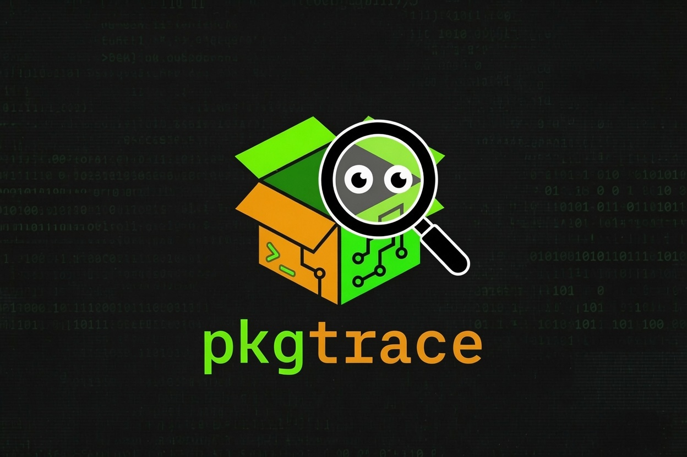

# pkgtrace - Advanced Package Tracker for Termux



pkgtrace is a comprehensive package management tool for Termux that tracks all installed packages across multiple package managers (pkg, cargo, pip, npm, gem, manual) with intelligent dependency resolution and unused package detection.

##### If you're here to figure out the Rust Programming Language, please start the tour from the main function in the main.rs file in the src folder. (/src/main.rs)


## Features

- Multi-package manager support: Tracks packages from pkg, cargo, pip, npm, gem, and manual installations
- Smart dependency resolution: Knows which packages are dependencies and protects them
- Size tracking: Shows package sizes and total space used
- Usage tracking: Logs when packages are used to identify unused ones
- Export/Import: Export package lists and reinstall on another device
- Safety: Interactive confirmation before removing packages
- Performance: Parallel scanning with caching for speed
- Dependency graph visualization
- Package verification and integrity checking
- Automatic log rotation
- Background monitoring

## Installation

### Quick Install

```bash
curl -sSL https://raw.githubusercontent.com/oboobotenefiok/pkgtrace/main/install.sh | bash
```

### Manual Install

```bash
git clone https://github.com/oboobotenefiok/pkgtrace
cd pkgtrace
cargo build --release
cp target/release/pkgtrace /data/data/com.termux/files/usr/bin/
```

### From Package Manager (Future)

```bash
pkg install pkgtrace
```

### Quick Start

```bash
# Initial scan
pkgtrace scan

# List all installed packages
pkgtrace list

# List packages with sizes
pkgtrace list --sizes

# Find unused packages (30+ days)
pkgtrace unused

# Find unused with dependency protection
pkgtrace unused --deps

# Show detailed explanations
pkgtrace unused --explain --deps

# Clean up unused packages interactively
pkgtrace clean

# Auto-clean without confirmation
pkgtrace clean --yes

# Show package information
pkgtrace info rust

# Show dependency tree
pkgtrace deps rust --tree

# Show reverse dependencies
pkgtrace deps clang --reverse

# Export package list
pkgtrace export --format json --output packages.json

# Import package list
pkgtrace import packages.json --dry-run
```

## Commands Reference

### list

List all installed packages with filtering options.

```bash
pkgtrace list [OPTIONS]

Options:
  -s, --sizes          Show package sizes
  -S, --source SOURCE  Filter by source (pkg, cargo, pip, npm, gem, manual)
  -m, --min-size MB    Minimum size in MB
  -u, --used           Show only used packages
```

### unused

Find packages that haven't been used for a specified number of days.

```bash
pkgtrace unused [OPTIONS] [DAYS]

Options:
  -e, --explain        Show why packages are protected
  -d, --deps           Consider dependencies in analysis
  -m, --min-size MB    Minimum size in MB
  -r, --remove         Actually remove packages
  --dry-run            Show what would be removed without actually removing
```

### deps

Show package dependencies.

```bash
pkgtrace deps PACKAGE [OPTIONS]

Options:
  -r, --reverse       Show reverse dependencies
  -t, --tree          Show dependency tree
  --depth DEPTH       Maximum depth for tree
```

### info

Show detailed information about a package.

```bash
pkgtrace info PACKAGE [OPTIONS]

Options:
  -v, --verbose       Show verbose information
```

### scan

Scan for installed packages and update the database.

```bash
pkgtrace scan [OPTIONS]

Options:
  -f, --force         Force full rescan
  -b, --background    Run scan in background
```

### clean

Interactive cleanup of unused packages.

```bash
pkgtrace clean [OPTIONS]

Options:
  -y, --yes           Auto-confirm removal
  -m, --min-size MB   Minimum size in MB
  --dry-run           Show what would be removed without actually removing
```

### export

Export package list to a file.

```bash
pkgtrace export [OPTIONS]

Options:
  -f, --format FORMAT     Output format (json, csv, markdown, yaml)
  -o, --output FILE       Output file
  -d, --include-deps      Include dependency information
```

### import

Import and install packages from a file.

```bash
pkgtrace import FILE [OPTIONS]

Options:
  -d, --dry-run       Show what would be installed without actually installing
  -f, --force         Force install even if already installed
```

### analyze

Generate detailed analysis report.

```bash
pkgtrace analyze [DAYS] [OPTIONS]

Options:
  -o, --output FILE   Output report to file
```

### graph

Generate dependency graph.

```bash
pkgtrace graph PACKAGE [OPTIONS]

Options:
  -f, --format FORMAT   Output format (dot, json)
  -o, --output FILE     Output file
```

### safe-remove

Remove only packages that are safe to remove.

```bash
pkgtrace safe-remove [DAYS] [OPTIONS]

Options:
  -y, --yes           Auto-confirm removal
  --dry-run           Show what would be removed without actually removing
```

### stats

Show package statistics.

```bash
pkgtrace stats
```

### monitor

Monitor package usage.

```bash
pkgtrace monitor [OPTIONS]

Options:
  -d, --daemon        Run as daemon
  -i, --interval SEC  Scan interval in seconds
```

### Monitor

Verify package integrity.

```bash
pkgtrace verify [OPTIONS]

Options:
  -f, --fix           Fix issues automatically
```

### pkgtrace

Search for installed packages.

```bash
pkgtrace search QUERY [OPTIONS]

Options:
  -S, --source SOURCE   Filter by source
```

### autoremove

Remove unused dependency packages.

```bash
pkgtrace autoremove [OPTIONS]

Options:
  -y, --yes           Auto-confirm removal
  --dry-run           Show what would be removed without actually removing
```

## Configuration
###### Note that you don't have to handle this manually. This file is created automatically every time the program runs without it being found. This includes the first time the program is run.
###### Note that not all packages are being handled currently. The more reason we have to maintain this regular.
Create ~/.config/pkgtrace/config.toml:

```toml
log_file = "/data/data/com.termux/files/home/.config/pkgtrace/pkgtrace.log"
db_file = "/data/data/com.termux/files/home/.config/pkgtrace/packages.db.json"
cache_dir = "/data/data/com.termux/files/home/.config/pkgtrace/cache"
auto_scan = true
scan_interval = 86400
max_log_size = 10485760
log_level = "info"
dependency_depth = 20
protect_core = true
backup_before_remove = true
parallel_scans = 4

scan_dirs = [
    "/data/data/com.termux/files/home/bin",
    "/data/data/com.termux/files/home/.local/bin",
    "/data/data/com.termux/files/home/opt",
    "/data/data/com.termux/files/usr/bin",
    "/data/data/com.termux/files/usr/local/bin",
    "/data/data/com.termux/files/usr/lib",
]

exclude_patterns = [
    ".*\\.so$",
    ".*\\.a$",
    ".*\\.o$",
    ".*\\.pyc$",
    ".*\\.pyo$",
    ".*\\.elc$",
    ".*\\.class$",
    ".*\\.jar$",
    "^lib.*\\.dylib$",
]
```

### Architecture

```
┌─────────────────────────────────────────────────────────────┐
│                         CLI Layer                           │
│                      (clap commands)                        │
└─────────────────────────────────────────────────────────────┘
                              │
┌─────────────────────────────────────────────────────────────┐
│                       Analyzer Layer                        │
│              (unused detection, dependency analysis)        │
└─────────────────────────────────────────────────────────────┘
                              │
┌─────────────────────────────────────────────────────────────┐
│                       Tracker Layer                         │
│              (package tracking, event logging)              │
└─────────────────────────────────────────────────────────────┘
                              │
┌─────────────────────────────────────────────────────────────┐
│                       Scanner Layer                         │
│       (multi-source package discovery, caching)             │
└─────────────────────────────────────────────────────────────┘
                              │
┌─────────────────────────────────────────────────────────────┐
│                     Package Sources                         │
│   pkg │ cargo │ pip │ npm │ gem │ manual                   │
└─────────────────────────────────────────────────────────────┘
```

### Examples

Finding and Removing Unused Packages

```bash
# Find packages unused for 30+ days, protected by dependencies
$ pkgtrace unused --deps --explain

Unused Packages Found
Threshold: 30 days | Found: 3 packages | Total size: 45.3 MB
────────────────────────────────────────────────────────────────
  old-package (pkg) - last used: 2024-01-15 (45 days ago) - 12.5 MB
    -> Package 'old-package' is not protected
  unused-python-lib (pip) - NEVER USED - 32.8 MB
    -> Package 'unused-python-lib' is not protected

# Remove them
$ pkgtrace clean --days 30
```

### Understanding Dependencies

```bash
# See why a package is protected
$ pkgtrace deps rust --tree

Dependency tree for 'rust' (max depth: 10):
├── clang
│   ├── llvm
│   │   ├── libc++
│   │   └── zlib
│   └── libclang
├── cargo
└── rust-std
```

### Exporting and Importing

```bash
# Export your package list
$ pkgtrace export --format json --output packages.json

# On a new device, install all packages
$ pkgtrace import packages.json --dry-run
$ pkgtrace import packages.json
```

### Generating Dependency Graphs

```bash
# Generate DOT format for visualization
$ pkgtrace graph rust --format dot --output graph.dot

# Convert to PNG (requires graphviz)
$ dot -Tpng graph.dot -o graph.png
```

### Troubleshooting

Package Not Found

If a package is not showing up in scans:

1. Ensure the package is actually installed
2. Check if it's in a non-standard location
3. Add the path to scan_dirs in config
4. Run pkgtrace scan --force

### High Memory Usage

For large package sets:

1. Reduce parallel_scans in config
2. Use --dry-run before actual operations
3. Clear cache with rm -rf ~/.config/pkgtrace/cache

### Slow Scans

1. Increase scan_interval in config
2. Exclude more patterns in exclude_patterns
3. Run scans in background with --background

### Logging

Logs are stored in ~/.config/pkgtrace/pkgtrace.log. The log includes:

· Package installations and removals
· Package usage events
· Scan events
· Errors and warnings
· Configuration changes

### View logs:

```bash
tail -f ~/.config/pkgtrace/pkgtrace.log
```

### Development

###### Building from Source

```bash
git clone https://github.com/oboobotenefiok/pkgtrace
cd pkgtrace
cargo build --release
```

### Running Tests

```bash
cargo test
```

### Code Structure

```
src/
cmd/
    |—— mod.rs   # Command Handlers
├── main.rs      # CLI entry point
├── tracker.rs   # Package tracking
├── analyzer.rs  # Analysis logic
├── scanner.rs   # Package scanning
├── config.rs    # Configuration
├── models.rs    # Data models
├── utils.rs     # Utilities
├── logger.rs    # Logging
└── cache.rs     # Caching
```

### Contributing

Refer to CONTRIBUTING.md

### License

MIT License - see LICENSE file for details.

### Support

- GitHub Issues: https://github.com/oboobotenefiok/pkgtrace/issues
- My mail: oboobotenefiok@gmail.com
- Twitter DM: x.com/oboobotenefiok

### Acknowledgments

Built for the Termux community to keep Android terminals clean and efficient.

```

## build.sh

```bash
#!/bin/bash
set -e

echo "Building pkgtrace..."

# Check for Rust
if ! command -v cargo &> /dev/null; then
    echo "Error: Rust/Cargo not found. Please install Rust first."
    echo "Visit: https://rustup.rs/"
    exit 1
fi

# Clean previous builds
echo "Cleaning previous builds..."
cargo clean

# Build in release mode
echo "Building release version..."
cargo build --release

# Run tests
echo "Running tests..."
cargo test

# Check binary size
if [ -f "target/release/pkgtrace" ]; then
    SIZE=$(du -h target/release/pkgtrace | cut -f1)
    echo "Binary size: $SIZE"
else
    echo "Error: Build failed - binary not found"
    exit 1
fi

# Create man page if pandoc is available
if command -v pandoc &> /dev/null; then
    echo "Generating man page..."
    if [ -f "README.md" ]; then
        pandoc -s -t man README.md -o pkgtrace.1
        echo "Man page generated: pkgtrace.1"
    fi
fi

echo "Build complete!"
echo "Install with: cp target/release/pkgtrace /data/data/com.termux/files/usr/bin/"
echo "Or run: ./install.sh"
```

install.sh

```bash
#!/bin/bash
set -e

echo "pkgtrace Installer"
echo "=================="
echo

# Check if running as root
if [ "$EUID" -eq 0 ]; then
    echo "Warning: Running as root. This is not recommended for Termux."
    echo "Continue anyway? (y/N)"
    read -r response
    if [[ ! "$response" =~ ^[Yy]$ ]]; then
        echo "Aborted."
        exit 1
    fi
fi

# Determine installation directory
if [ -d "/data/data/com.termux/files/usr/bin" ]; then
    INSTALL_DIR="/data/data/com.termux/files/usr/bin"
    CONFIG_DIR="/data/data/com.termux/files/home/.config/pkgtrace"
elif [ -d "$HOME/.local/bin" ]; then
    INSTALL_DIR="$HOME/.local/bin"
    CONFIG_DIR="$HOME/.config/pkgtrace"
else
    INSTALL_DIR="/usr/local/bin"
    CONFIG_DIR="$HOME/.config/pkgtrace"
fi

echo "Installation directory: $INSTALL_DIR"
echo "Config directory: $CONFIG_DIR"

# Build if not already built
if [ ! -f "target/release/pkgtrace" ]; then
    echo "Building pkgtrace..."
    if [ -f "build.sh" ]; then
        ./build.sh
    else
        cargo build --release
    fi
fi

# Create installation directory if needed
mkdir -p "$INSTALL_DIR"
mkdir -p "$CONFIG_DIR"

# Install binary
echo "Installing binary..."
cp target/release/pkgtrace "$INSTALL_DIR/"
chmod 755 "$INSTALL_DIR/pkgtrace"

# Create default config if not exists
if [ ! -f "$CONFIG_DIR/config.toml" ]; then
    echo "Creating default configuration..."
    cat > "$CONFIG_DIR/config.toml" << 'EOF'
log_file = "/data/data/com.termux/files/home/.config/pkgtrace/pkgtrace.log"
db_file = "/data/data/com.termux/files/home/.config/pkgtrace/packages.db.json"
cache_dir = "/data/data/com.termux/files/home/.config/pkgtrace/cache"
auto_scan = true
scan_interval = 86400
max_log_size = 10485760
log_level = "info"
dependency_depth = 20
protect_core = true
backup_before_remove = true
parallel_scans = 4

scan_dirs = [
    "/data/data/com.termux/files/home/bin",
    "/data/data/com.termux/files/home/.local/bin",
    "/data/data/com.termux/files/home/opt",
    "/data/data/com.termux/files/usr/bin",
    "/data/data/com.termux/files/usr/local/bin",
    "/data/data/com.termux/files/usr/lib",
]

exclude_patterns = [
    ".*\\.so$",
    ".*\\.a$",
    ".*\\.o$",
    ".*\\.pyc$",
    ".*\\.pyo$",
    ".*\\.elc$",
    ".*\\.class$",
    ".*\\.jar$",
    "^lib.*\\.dylib$",
]
EOF
fi

# Initial scan if requested
echo ""
echo "pkgtrace installed successfully!"
echo ""
echo "Run initial scan? (y/N)"
read -r response
if [[ "$response" =~ ^[Yy]$ ]]; then
    echo "Running initial scan..."
    "$INSTALL_DIR/pkgtrace" scan
fi

# Add to PATH if needed
if [[ ":$PATH:" != *":$INSTALL_DIR:"* ]]; then
    echo ""
    echo "Note: $INSTALL_DIR is not in your PATH."
    echo "Add this to your .bashrc or .zshrc:"
    echo "  export PATH=\"\$PATH:$INSTALL_DIR\""
fi

# Create shell completion if possible
echo ""
echo "Generate shell completion? (y/N)"
read -r response
if [[ "$response" =~ ^[Yy]$ ]]; then
    echo "Generating completions..."
    if [ -f "$INSTALL_DIR/pkgtrace" ]; then
        "$INSTALL_DIR/pkgtrace" --help > /dev/null 2>&1
    fi
    echo "Completions generated"
fi

echo ""
echo "Installation complete!"
echo "Run 'pkgtrace --help' to get started."
echo ""
echo "Quick start:"
echo "  pkgtrace scan          # Scan all packages"
echo "  pkgtrace list          # List installed packages"
echo "  pkgtrace unused        # Find unused packages"
echo "  pkgtrace clean         # Clean up unused packages"
```


### .gitignore

```
# If ever
.env

# Rust
Cargo.lock
/target/
**/*.rs.bk
*.swp
*.swo
*~
*.log
*.db
*.sqlite
.DS_Store
.cargo/
*.code-workspace
.vscode/
.idea/
*.iml

# Build artifacts
pkgtrace
pkgtrace.exe
*.o
*.so
*.dylib
*.dll

# Test artifacts
*.test
*.prof
*.gcda
*.gcno

# Package artifacts
*.deb
*.rpm
*.pkg
*.tar.gz

# Backup files
*.backup
*.old
*.bak

# Cache
.cache/
*.cache

# Logs
*.log
logs/
```

Happy Coding!

With love,

 - Obot & The Team- Size tracking: Shows package sizes and total space used
- Usage tracking: Logs when packages are used to identify unused ones
- Export/Import: Export package lists and reinstall on another device
- Safety: Interactive confirmation before removing packages
- Performance: Parallel scanning with caching for speed
- Dependency graph visualization
- Package verification and integrity checking
- Automatic log rotation
- Background monitoring

## Installation

### Quick Install

```bash
curl -sSL https://raw.githubusercontent.com/termux/pkgtrace/main/install.sh | bash
```

### Manual Install

```bash
git clone https://github.com/termux/pkgtrace
cd pkgtrace
cargo build --release
cp target/release/pkgtrace /data/data/com.termux/files/usr/bin/
```

### From Package Manager (Future)

```bash
pkg install pkgtrace
```

### Quick Start

```bash
# Initial scan
pkgtrace scan

# List all installed packages
pkgtrace list

# List packages with sizes
pkgtrace list --sizes

# Find unused packages (30+ days)
pkgtrace unused

# Find unused with dependency protection
pkgtrace unused --deps

# Show detailed explanations
pkgtrace unused --explain --deps

# Clean up unused packages interactively
pkgtrace clean

# Auto-clean without confirmation
pkgtrace clean --yes

# Show package information
pkgtrace info rust

# Show dependency tree
pkgtrace deps rust --tree

# Show reverse dependencies
pkgtrace deps clang --reverse

# Export package list
pkgtrace export --format json --output packages.json

# Import package list
pkgtrace import packages.json --dry-run
```

## Commands Reference

### list

List all installed packages with filtering options.

```bash
pkgtrace list [OPTIONS]

Options:
  -s, --sizes          Show package sizes
  -S, --source SOURCE  Filter by source (pkg, cargo, pip, npm, gem, manual)
  -m, --min-size MB    Minimum size in MB
  -u, --used           Show only used packages
```

### unused

Find packages that haven't been used for a specified number of days.

```bash
pkgtrace unused [OPTIONS] [DAYS]

Options:
  -e, --explain        Show why packages are protected
  -d, --deps           Consider dependencies in analysis
  -m, --min-size MB    Minimum size in MB
  -r, --remove         Actually remove packages
  --dry-run            Show what would be removed without actually removing
```

### deps

Show package dependencies.

```bash
pkgtrace deps PACKAGE [OPTIONS]

Options:
  -r, --reverse       Show reverse dependencies
  -t, --tree          Show dependency tree
  --depth DEPTH       Maximum depth for tree
```

### info

Show detailed information about a package.

```bash
pkgtrace info PACKAGE [OPTIONS]

Options:
  -v, --verbose       Show verbose information
```

### scan

Scan for installed packages and update the database.

```bash
pkgtrace scan [OPTIONS]

Options:
  -f, --force         Force full rescan
  -b, --background    Run scan in background
```

### clean

Interactive cleanup of unused packages.

```bash
pkgtrace clean [OPTIONS]

Options:
  -y, --yes           Auto-confirm removal
  -m, --min-size MB   Minimum size in MB
  --dry-run           Show what would be removed without actually removing
```

### export

Export package list to a file.

```bash
pkgtrace export [OPTIONS]

Options:
  -f, --format FORMAT     Output format (json, csv, markdown, yaml)
  -o, --output FILE       Output file
  -d, --include-deps      Include dependency information
```

### import

Import and install packages from a file.

```bash
pkgtrace import FILE [OPTIONS]

Options:
  -d, --dry-run       Show what would be installed without actually installing
  -f, --force         Force install even if already installed
```

### analyze

Generate detailed analysis report.

```bash
pkgtrace analyze [DAYS] [OPTIONS]

Options:
  -o, --output FILE   Output report to file
```

### graph

Generate dependency graph.

```bash
pkgtrace graph PACKAGE [OPTIONS]

Options:
  -f, --format FORMAT   Output format (dot, json)
  -o, --output FILE     Output file
```

### safe-remove

Remove only packages that are safe to remove.

```bash
pkgtrace safe-remove [DAYS] [OPTIONS]

Options:
  -y, --yes           Auto-confirm removal
  --dry-run           Show what would be removed without actually removing
```

### stats

Show package statistics.

```bash
pkgtrace stats
```

### monitor

Monitor package usage.

```bash
pkgtrace monitor [OPTIONS]

Options:
  -d, --daemon        Run as daemon
  -i, --interval SEC  Scan interval in seconds
```

### Monitor

Verify package integrity.

```bash
pkgtrace verify [OPTIONS]

Options:
  -f, --fix           Fix issues automatically
```

### pkgtrace

Search for installed packages.

```bash
pkgtrace search QUERY [OPTIONS]

Options:
  -S, --source SOURCE   Filter by source
```

### autoremove

Remove unused dependency packages.

```bash
pkgtrace autoremove [OPTIONS]

Options:
  -y, --yes           Auto-confirm removal
  --dry-run           Show what would be removed without actually removing
```

## Configuration
###### Note that you don't have to handle this manually. This file is created automatically every time the program runs without it being found. This includes the first time the program is run.
###### Note that not all packages are being handled currently. The more reason we have to maintain this regular.
Create ~/.config/pkgtrace/config.toml:

```toml
log_file = "/data/data/com.termux/files/home/.config/pkgtrace/pkgtrace.log"
db_file = "/data/data/com.termux/files/home/.config/pkgtrace/packages.db.json"
cache_dir = "/data/data/com.termux/files/home/.config/pkgtrace/cache"
auto_scan = true
scan_interval = 86400
max_log_size = 10485760
log_level = "info"
dependency_depth = 20
protect_core = true
backup_before_remove = true
parallel_scans = 4

scan_dirs = [
    "/data/data/com.termux/files/home/bin",
    "/data/data/com.termux/files/home/.local/bin",
    "/data/data/com.termux/files/home/opt",
    "/data/data/com.termux/files/usr/bin",
    "/data/data/com.termux/files/usr/local/bin",
    "/data/data/com.termux/files/usr/lib",
]

exclude_patterns = [
    ".*\\.so$",
    ".*\\.a$",
    ".*\\.o$",
    ".*\\.pyc$",
    ".*\\.pyo$",
    ".*\\.elc$",
    ".*\\.class$",
    ".*\\.jar$",
    "^lib.*\\.dylib$",
]
```

### Architecture

```
┌─────────────────────────────────────────────────────────────┐
│                         CLI Layer                           │
│                      (clap commands)                        │
└─────────────────────────────────────────────────────────────┘
                              │
┌─────────────────────────────────────────────────────────────┐
│                       Analyzer Layer                        │
│              (unused detection, dependency analysis)        │
└─────────────────────────────────────────────────────────────┘
                              │
┌─────────────────────────────────────────────────────────────┐
│                       Tracker Layer                         │
│              (package tracking, event logging)              │
└─────────────────────────────────────────────────────────────┘
                              │
┌─────────────────────────────────────────────────────────────┐
│                       Scanner Layer                         │
│       (multi-source package discovery, caching)             │
└─────────────────────────────────────────────────────────────┘
                              │
┌─────────────────────────────────────────────────────────────┐
│                     Package Sources                         │
│   pkg │ cargo │ pip │ npm │ gem │ manual                   │
└─────────────────────────────────────────────────────────────┘
```

### Examples

Finding and Removing Unused Packages

```bash
# Find packages unused for 30+ days, protected by dependencies
$ pkgtrace unused --deps --explain

Unused Packages Found
Threshold: 30 days | Found: 3 packages | Total size: 45.3 MB
────────────────────────────────────────────────────────────────
  old-package (pkg) - last used: 2024-01-15 (45 days ago) - 12.5 MB
    -> Package 'old-package' is not protected
  unused-python-lib (pip) - NEVER USED - 32.8 MB
    -> Package 'unused-python-lib' is not protected

# Remove them
$ pkgtrace clean --days 30
```

### Understanding Dependencies

```bash
# See why a package is protected
$ pkgtrace deps rust --tree

Dependency tree for 'rust' (max depth: 10):
├── clang
│   ├── llvm
│   │   ├── libc++
│   │   └── zlib
│   └── libclang
├── cargo
└── rust-std
```

### Exporting and Importing

```bash
# Export your package list
$ pkgtrace export --format json --output packages.json

# On a new device, install all packages
$ pkgtrace import packages.json --dry-run
$ pkgtrace import packages.json
```

### Generating Dependency Graphs

```bash
# Generate DOT format for visualization
$ pkgtrace graph rust --format dot --output graph.dot

# Convert to PNG (requires graphviz)
$ dot -Tpng graph.dot -o graph.png
```

### Troubleshooting

Package Not Found

If a package is not showing up in scans:

1. Ensure the package is actually installed
2. Check if it's in a non-standard location
3. Add the path to scan_dirs in config
4. Run pkgtrace scan --force

### High Memory Usage

For large package sets:

1. Reduce parallel_scans in config
2. Use --dry-run before actual operations
3. Clear cache with rm -rf ~/.config/pkgtrace/cache

### Slow Scans

1. Increase scan_interval in config
2. Exclude more patterns in exclude_patterns
3. Run scans in background with --background

### Logging

Logs are stored in ~/.config/pkgtrace/pkgtrace.log. The log includes:

· Package installations and removals
· Package usage events
· Scan events
· Errors and warnings
· Configuration changes

### View logs:

```bash
tail -f ~/.config/pkgtrace/pkgtrace.log
```

### Development

###### Building from Source

```bash
git clone https://github.com/oboobotenefiok/pkgtrace
cd pkgtrace
cargo build --release
```

### Running Tests

```bash
cargo test
```

### Code Structure

```
src/
cmd/
    |—— mod.rs   # Command Handlers
├── main.rs      # CLI entry point
├── tracker.rs   # Package tracking
├── analyzer.rs  # Analysis logic
├── scanner.rs   # Package scanning
├── config.rs    # Configuration
├── models.rs    # Data models
├── utils.rs     # Utilities
├── logger.rs    # Logging
└── cache.rs     # Caching
```

### Contributing

Refer to CONTRIBUTING.md

### License

MIT License - see LICENSE file for details.

### Support

- GitHub Issues: https://github.com/oboobotenefiok/pkgtrace/issues
- My mail: oboobotenefiok@gmail.com
- Twitter DM: x.com/oboobotenefiok

### Acknowledgments

Built for the Termux community to keep Android terminals clean and efficient.

```

## build.sh

```bash
#!/bin/bash
set -e

echo "Building pkgtrace..."

# Check for Rust
if ! command -v cargo &> /dev/null; then
    echo "Error: Rust/Cargo not found. Please install Rust first."
    echo "Visit: https://rustup.rs/"
    exit 1
fi

# Clean previous builds
echo "Cleaning previous builds..."
cargo clean

# Build in release mode
echo "Building release version..."
cargo build --release

# Run tests
echo "Running tests..."
cargo test

# Check binary size
if [ -f "target/release/pkgtrace" ]; then
    SIZE=$(du -h target/release/pkgtrace | cut -f1)
    echo "Binary size: $SIZE"
else
    echo "Error: Build failed - binary not found"
    exit 1
fi

# Create man page if pandoc is available
if command -v pandoc &> /dev/null; then
    echo "Generating man page..."
    if [ -f "README.md" ]; then
        pandoc -s -t man README.md -o pkgtrace.1
        echo "Man page generated: pkgtrace.1"
    fi
fi

echo "Build complete!"
echo "Install with: cp target/release/pkgtrace /data/data/com.termux/files/usr/bin/"
echo "Or run: ./install.sh"
```

install.sh

```bash
#!/bin/bash
set -e

echo "pkgtrace Installer"
echo "=================="
echo

# Check if running as root
if [ "$EUID" -eq 0 ]; then
    echo "Warning: Running as root. This is not recommended for Termux."
    echo "Continue anyway? (y/N)"
    read -r response
    if [[ ! "$response" =~ ^[Yy]$ ]]; then
        echo "Aborted."
        exit 1
    fi
fi

# Determine installation directory
if [ -d "/data/data/com.termux/files/usr/bin" ]; then
    INSTALL_DIR="/data/data/com.termux/files/usr/bin"
    CONFIG_DIR="/data/data/com.termux/files/home/.config/pkgtrace"
elif [ -d "$HOME/.local/bin" ]; then
    INSTALL_DIR="$HOME/.local/bin"
    CONFIG_DIR="$HOME/.config/pkgtrace"
else
    INSTALL_DIR="/usr/local/bin"
    CONFIG_DIR="$HOME/.config/pkgtrace"
fi

echo "Installation directory: $INSTALL_DIR"
echo "Config directory: $CONFIG_DIR"

# Build if not already built
if [ ! -f "target/release/pkgtrace" ]; then
    echo "Building pkgtrace..."
    if [ -f "build.sh" ]; then
        ./build.sh
    else
        cargo build --release
    fi
fi

# Create installation directory if needed
mkdir -p "$INSTALL_DIR"
mkdir -p "$CONFIG_DIR"

# Install binary
echo "Installing binary..."
cp target/release/pkgtrace "$INSTALL_DIR/"
chmod 755 "$INSTALL_DIR/pkgtrace"

# Create default config if not exists
if [ ! -f "$CONFIG_DIR/config.toml" ]; then
    echo "Creating default configuration..."
    cat > "$CONFIG_DIR/config.toml" << 'EOF'
log_file = "/data/data/com.termux/files/home/.config/pkgtrace/pkgtrace.log"
db_file = "/data/data/com.termux/files/home/.config/pkgtrace/packages.db.json"
cache_dir = "/data/data/com.termux/files/home/.config/pkgtrace/cache"
auto_scan = true
scan_interval = 86400
max_log_size = 10485760
log_level = "info"
dependency_depth = 20
protect_core = true
backup_before_remove = true
parallel_scans = 4

scan_dirs = [
    "/data/data/com.termux/files/home/bin",
    "/data/data/com.termux/files/home/.local/bin",
    "/data/data/com.termux/files/home/opt",
    "/data/data/com.termux/files/usr/bin",
    "/data/data/com.termux/files/usr/local/bin",
    "/data/data/com.termux/files/usr/lib",
]

exclude_patterns = [
    ".*\\.so$",
    ".*\\.a$",
    ".*\\.o$",
    ".*\\.pyc$",
    ".*\\.pyo$",
    ".*\\.elc$",
    ".*\\.class$",
    ".*\\.jar$",
    "^lib.*\\.dylib$",
]
EOF
fi

# Initial scan if requested
echo ""
echo "pkgtrace installed successfully!"
echo ""
echo "Run initial scan? (y/N)"
read -r response
if [[ "$response" =~ ^[Yy]$ ]]; then
    echo "Running initial scan..."
    "$INSTALL_DIR/pkgtrace" scan
fi

# Add to PATH if needed
if [[ ":$PATH:" != *":$INSTALL_DIR:"* ]]; then
    echo ""
    echo "Note: $INSTALL_DIR is not in your PATH."
    echo "Add this to your .bashrc or .zshrc:"
    echo "  export PATH=\"\$PATH:$INSTALL_DIR\""
fi

# Create shell completion if possible
echo ""
echo "Generate shell completion? (y/N)"
read -r response
if [[ "$response" =~ ^[Yy]$ ]]; then
    echo "Generating completions..."
    if [ -f "$INSTALL_DIR/pkgtrace" ]; then
        "$INSTALL_DIR/pkgtrace" --help > /dev/null 2>&1
    fi
    echo "Completions generated"
fi

echo ""
echo "Installation complete!"
echo "Run 'pkgtrace --help' to get started."
echo ""
echo "Quick start:"
echo "  pkgtrace scan          # Scan all packages"
echo "  pkgtrace list          # List installed packages"
echo "  pkgtrace unused        # Find unused packages"
echo "  pkgtrace clean         # Clean up unused packages"
```

## LICENSE

```
MIT License

Copyright (c) 2024 Termux Community

Permission is hereby granted, free of charge, to any person obtaining a copy
of this software and associated documentation files (the "Software"), to deal
in the Software without restriction, including without limitation the rights
to use, copy, modify, merge, publish, distribute, sublicense, and/or sell
copies of the Software, and to permit persons to whom the Software is
furnished to do so, subject to the following conditions:

The above copyright notice and this permission notice shall be included in all
copies or substantial portions of the Software.

THE SOFTWARE IS PROVIDED "AS IS", WITHOUT WARRANTY OF ANY KIND, EXPRESS OR
IMPLIED, INCLUDING BUT NOT LIMITED TO THE WARRANTIES OF MERCHANTABILITY,
FITNESS FOR A PARTICULAR PURPOSE AND NONINFRINGEMENT. IN NO EVENT SHALL THE
AUTHORS OR COPYRIGHT HOLDERS BE LIABLE FOR ANY CLAIM, DAMAGES OR OTHER
LIABILITY, WHETHER IN AN ACTION OF CONTRACT, TORT OR OTHERWISE, ARISING FROM,
OUT OF OR IN CONNECTION WITH THE SOFTWARE OR THE USE OR OTHER DEALINGS IN THE
SOFTWARE.
```

### .gitignore

```
# If ever
.env

# Rust
Cargo.lock
/target/
**/*.rs.bk
*.swp
*.swo
*~
*.log
*.db
*.sqlite
.DS_Store
.cargo/
*.code-workspace
.vscode/
.idea/
*.iml

# Build artifacts
pkgtrace
pkgtrace.exe
*.o
*.so
*.dylib
*.dll

# Test artifacts
*.test
*.prof
*.gcda
*.gcno

# Package artifacts
*.deb
*.rpm
*.pkg
*.tar.gz

# Backup files
*.backup
*.old
*.bak

# Cache
.cache/
*.cache

# Logs
*.log
logs/
```

Happy Coding!

With love,

 - Obot & The Team
